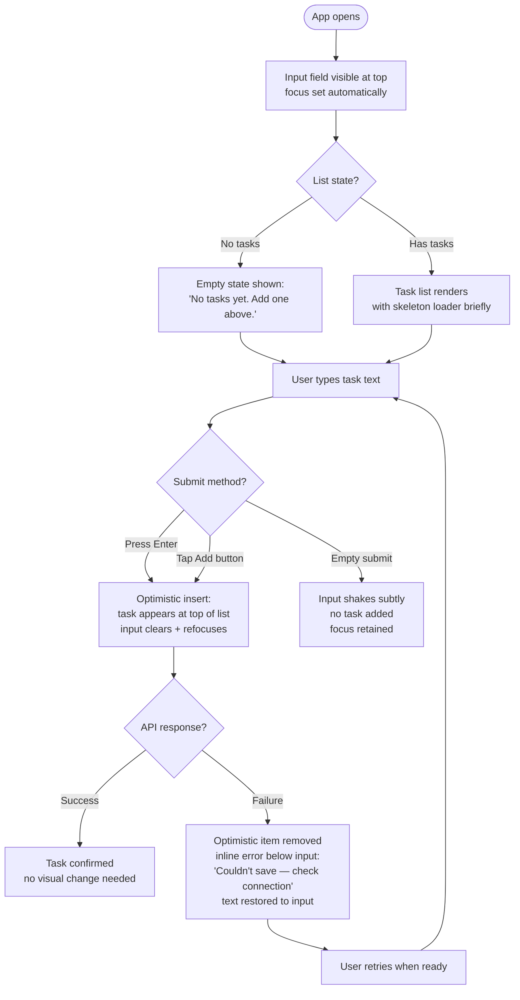
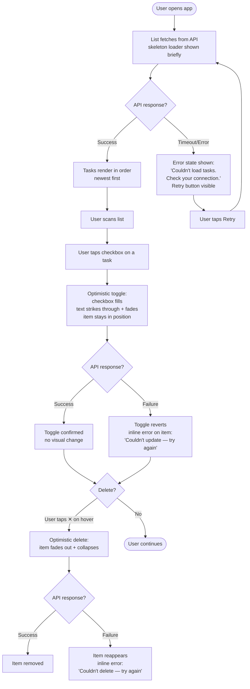
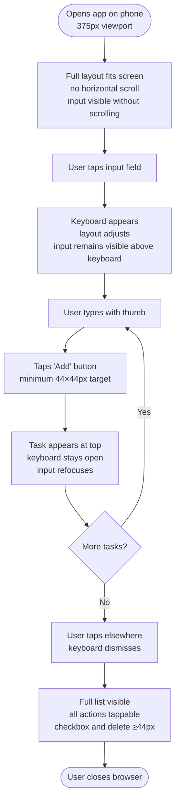
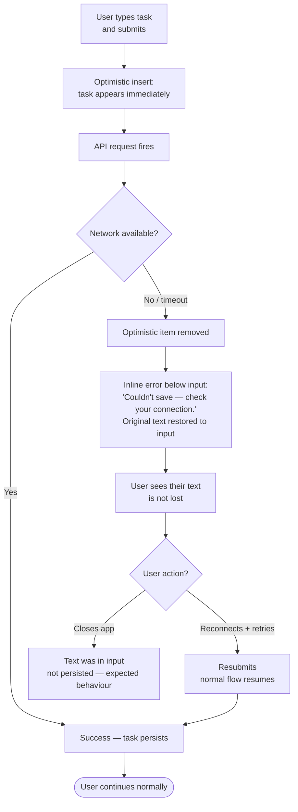

# UX Design Specification - BMAD_2

**Author:** Francesco
**Date:** 9 April 2026

---

## Executive Summary

### Project Vision

The Todo App is a deliberately minimal personal task management single-page application. Its defining value proposition is the _absence_ of friction: no accounts, no onboarding, no configuration. A user opens the app and it works — tasks are created instantly, persist across sessions, and are accessible on any device. The product's restraint is its feature.

### Target Users

A single primary archetype: an individual who needs to capture and track personal tasks immediately, without setup or ceremony. They are comfortable with modern browsers and use both desktop and mobile devices. They have likely been frustrated by over-engineered productivity tools that impose accounts, tutorials, or complex UI before allowing a single task to be typed. Speed of capture and reliability of persistence are their core needs.

### Key Design Challenges

1. **The blank canvas paradox** — A minimal app risks feeling _empty_ rather than _clean_. The empty state must actively invite action, not merely acknowledge absence.
2. **Completion without disappearance** — Completed tasks must feel visually "done" without vanishing, allowing users to see their progress. The visual distinction between active and completed states must be immediately legible without being disruptive.
3. **Graceful failure as trust-building** — Network errors and failed saves must surface with clarity and calm. Silent failures destroy trust; well-designed error states build it.

### Design Opportunities

1. The simplicity constraint _is_ the differentiator — precise spacing, well-considered micro-interactions, and a calm visual language can make this feel premium through restraint rather than richness.
2. Mobile-first design: the "quick capture on the go" scenario is a primary use case and should drive interaction patterns, not be an afterthought.
3. Error states, designed well, are a trust signal — a user who sees a thoughtful, honest error message will trust the application more than one that silently ignores failures.

## Core User Experience

### Defining Experience

The defining interaction of the Todo App is the **task creation loop**: type a task → press Enter → watch it appear. This must be instantaneous, visually clean, and require zero thought. Everything else in the product serves or supports this moment.

The secondary defining experience is **return continuity**: a user who closed the app yesterday and opens it today should feel their context is intact. Their tasks are there, exactly as they left them. No loading spinners lingering. No "welcome back" friction. Just the list.

### Platform Strategy

The application is a web SPA targeting all modern browsers on desktop and mobile (375px–1440px). While both platforms are supported equally, interaction patterns are designed **mobile-first**: touch-friendly targets (minimum 44×44px), reachable actions within thumb range, and no reliance on hover states for critical affordances. Desktop layouts use the additional space for breathing room, not additional complexity.

No offline functionality is required for v1. Network errors surface clearly rather than being silently queued.

### Effortless Interactions

- **Enter to submit** — no button click required to add a task; keyboard and tap both work
- **Inline toggle** — a single tap/click on the checkbox completes a task; no confirmation dialog
- **Inline delete** — a single action removes a task; no multi-step confirmation for MVP
- **Input stays focused** — after adding a task, focus returns immediately to the input field for rapid multi-task capture
- **No save button** — every action persists automatically; users never manage state manually

### Critical Success Moments

1. **First task created** — within seconds of opening the app, with no instruction needed
2. **App reopened** — tasks are still there; persistence is invisible and reliable
3. **A task completed** — the visual shift is immediate, satisfying, and legible at a glance
4. **An error surfaced** — the user sees a clear, calm message and knows what happened; nothing is lost

### Experience Principles

1. **Restraint is the feature** — every element present earns its place; nothing decorative, nothing surplus
2. **Confidence through clarity** — the UI never leaves the user wondering what happened or what to do next
3. **Speed of capture above all** — adding a task must feel faster than writing on paper
4. **Errors are honest, not alarming** — failures are communicated plainly, without drama or ambiguity
5. **Calm by default** — transitions are subtle, palette is muted, microcopy is matter-of-fact

## Desired Emotional Response

### Primary Emotional Goals

The Todo App should above all make users feel **in control and calm**. Not excited. Not delighted in a loud way. The ideal emotional state is the quiet confidence of someone who has a clear head — tasks captured, nothing forgotten, nothing overwhelming them. The app succeeds emotionally when users don't think about it at all; it's simply _there_, working.

The secondary emotional goal is **trust**. Users should feel their data is safe, their actions have effect, and the app won't surprise them in ways they didn't invite.

### Emotional Journey Mapping

| Moment                           | Desired Feeling       | Anti-target (Avoid) |
| -------------------------------- | --------------------- | ------------------- |
| First open — empty state         | Invited, not lost     | Confused, abandoned |
| Task created — appears in list   | Relieved, satisfied   | Anxious, uncertain  |
| Task completed — toggle fired    | Quietly accomplished  | Hollow, meaningless |
| App reopened — tasks still there | Trust, continuity     | Surprise, doubt     |
| Network error surfaced           | Informed, not alarmed | Panicked, lost      |
| Long list of todos               | Organised, in control | Overwhelmed, guilty |

### Micro-Emotions

- **Confidence over confusion** — every action produces immediate, legible feedback
- **Trust over skepticism** — persistence and reliability must be felt, not just known
- **Satisfaction over excitement** — completion is quiet and real, not celebratory
- **Calm over anxiety** — error states are clear and actionable, never alarming
- **Focus over distraction** — the UI adds no noise that competes with the user's tasks

### Design Implications

- **Satisfied / Relieved on task creation** → immediate list insertion with a subtle fade-in; no bounce, no fanfare; input resets and refocuses silently
- **Quiet accomplishment on completion** → a gentle strikethrough + opacity shift on the completed item; a soft checkmark animation (150–200ms ease-out); no sounds, no confetti
- **Trust through persistence** → tasks load quickly on open with a minimal, non-intrusive skeleton or spinner; no "loading…" text that lingers
- **Calm error states** → inline, muted-tone error messages (not red banners); plain language ("Couldn't save — check your connection"); original input preserved
- **Control over a long list** → no automatic hiding or archiving of completed items in v1; users decide what stays visible

### Emotional Design Principles

1. **Quiet confidence** — the UI feels stable and predictable; no unexpected movement or state changes
2. **Earned delight** — micro-animations are subtle, purposeful, and never repeated on demand; they reward action without demanding attention
3. **Visible progress** — completed items remain visible (greyed and struck); the list is a record, not a scoreboard
4. **Honest calm** — errors are never hidden, and never dramatised; the tone is a trusted colleague, not an alarm

## UX Pattern Analysis & Inspiration

### Inspiring Products Analysis

**Bear (Primary Reference)**

Bear is the clearest tonal reference for this product. What makes it exceptional:

- **Typography-first hierarchy** — content is the UI; controls are subordinate and appear only when needed
- **Muted, warm palette** — not stark white, not high-contrast primary colors; a calm off-white or soft neutral base that reduces visual fatigue
- **Chrome disappears** — toolbars, sidebars, and actions recede when not in use; the user's content takes the full stage
- **Generous line height and spacing** — everything breathes; nothing feels cramped or urgent
- **Soft interaction feedback** — selections, transitions, and highlights feel physical without being dramatic

What to adopt directly: the principle that controls are secondary to content. In our context, the todo text is the star — checkboxes, delete buttons, and other controls should feel quiet and peripheral until needed.

### Transferable Patterns

**Interaction Patterns:**

- **Hover-reveal actions** — delete and secondary actions appear on hover (desktop) or expand on tap (mobile), keeping the resting list state visually clean
- **Enter to submit** — Bear's quick capture feel; no button, no friction, no mode-switching
- **Immediate inline feedback** — state changes (add, complete, delete) happen in-place with subtle animation; no full list reload or jarring reflow
- **Text-centric list items** — the task description is the primary visual element; status indicators (checkbox, strikethrough) are supporting, not dominant

**Visual Patterns:**

- **Neutral base with single accent** — one muted accent color for interactive elements (checkboxes, focus states); no competing colors
- **Strikethrough as completion signal** — paired with reduced opacity; text stays readable but clearly "retired"
- **Consistent vertical rhythm** — fixed row height or generous padding creates a sense of order and calm

### Anti-Patterns to Avoid

- ❌ **Confirmation dialogs before delete** — interrupts the flow; for a single-user personal tool with no irreversible consequences, a direct delete is the right default. If undo is added in future, it replaces confirmation — but for MVP, delete is immediate and final.
- ❌ **Aggressive empty states** — large illustrations, marketing copy, or gamified prompts conflict with the calm register of this product
- ❌ **Persistent visible delete buttons** — showing a delete icon on every row at all times creates visual noise; reveal on interaction instead
- ❌ **Toast notifications for successful actions** — if an action worked, the list updated — that _is_ the confirmation; toasts add visual clutter for information the UI already communicates
- ❌ **Drag-to-reorder in MVP** — introduces accidental interaction on mobile, adds implementation complexity, and implies a prioritisation model the product doesn't yet have

### Design Inspiration Strategy

**Adopt:**

- Bear's typography hierarchy and content-first visual philosophy
- Subtle hover/tap-reveal for secondary actions
- Muted neutral palette with a single calm accent

**Adapt:**

- Bear's chrome-disappearing principle → apply to the input area; controls recede when not in use
- Single-view focus → no navigation, no sidebar; the list _is_ the app

**Avoid:**

- Any pattern that implies the app is trying to engage, retain, or congratulate the user
- Visual patterns borrowed from project management or team tools (labels, drag handles, priority dots)

## Design System Foundation

### Design System Choice

**Tailwind CSS + shadcn/ui (Radix UI primitives)**

The chosen approach is a utility-first CSS foundation (Tailwind CSS) paired with unstyled, accessible component primitives via shadcn/ui — a collection of components built on Radix UI that are copied directly into the project, not installed as a black-box dependency. This means full visual ownership with accessibility behaviour handled by proven, tested primitives.

### Rationale for Selection

- **Full visual ownership** — no pre-baked aesthetic to fight against; the calm, muted, Bear-inspired visual language is applied from scratch on a neutral foundation
- **Accessibility by default** — Radix UI primitives handle keyboard navigation, ARIA attributes, focus management, and screen-reader semantics; WCAG 2.1 AA compliance is structurally built in rather than bolted on
- **React-native fit** — Tailwind and shadcn/ui are the dominant pairing in the current React ecosystem; the developer experience is excellent and documentation is thorough
- **No runtime overhead** — Tailwind is purged at build time; shadcn/ui components are local source files, not an installed library; the bundle stays lean
- **Right-sized for scope** — for a focused SPA with a small component surface, this stack avoids the overhead of a full design system while still providing a consistent, extensible foundation

### Implementation Approach

Components are owned locally — `shadcn/ui add` copies component source into the project. This means components live in the codebase and can be modified freely, with no version lock-in or upstream breaking changes.

The component surface for this product is deliberately small:

| Component              | Source                                 |
| ---------------------- | -------------------------------------- |
| Text input             | shadcn/ui `Input`                      |
| Button (submit)        | shadcn/ui `Button`                     |
| Checkbox               | shadcn/ui `Checkbox` (Radix primitive) |
| Todo list item         | Custom, built with Tailwind            |
| Error / status message | Custom inline component                |
| Loading state          | Tailwind skeleton or spinner           |

### Customization Strategy

- **Design tokens as CSS variables** — all colors, spacing, typography, and radius values defined as CSS custom properties in a single `globals.css`; the calm, muted palette is applied at the token level, not scattered across components
- **Single accent color** — one muted interactive color (e.g., slate-blue or warm grey) used for checkboxes, focus rings, and active input borders; no competing hues
- **Typography** — a single system or variable font (Inter or Geist); no decorative typefaces
- **Radius** — subtle rounding (4–6px); not sharp, not pill-shaped; feels grounded

## Defining Core Experience

### The Defining Interaction

> _"Type a task. Press Enter. It's there."_

This is the heartbeat of the Todo App. Every other interaction is secondary. If this moment feels instant, reliable, and effortless, the product succeeds.

### User Mental Model

Users arrive with a "notepad" mental model — they expect to type and see. They don't expect modes, steps, or confirmation. The app must match this model exactly: the input is always visible, always ready, and submitting requires no deliberate save action. The list is the notepad; tasks are notes.

Users have been conditioned by overbuilt tools to expect friction before this moment. Removing that friction entirely is the product's primary differentiator.

### Core Experience Mechanics

**1. Initiation**

- The input field sits at the top of the view, always visible, with focus on page load
- Placeholder text is minimal and instructional: _"Add a task…"_
- No button required to begin — the field is immediately ready

**2. Interaction**

- User types task description
- Presses Enter (keyboard) or taps the submit button (touch)
- Client performs optimistic insert: task appears immediately at the top of the list, before the API confirms
- Input field clears and focus returns automatically — ready for the next task

**3. Feedback**

- New task fades in at the top of the list (subtle opacity transition, ~150ms)
- No toast, no banner, no confirmation — the list update _is_ the confirmation
- On API failure: the optimistically inserted item is removed and an inline error appears below the input; the typed text is restored so the user can retry

**4. Completion**

- The task item is immediately visible at the top of the list
- The user can begin typing the next task without any action required

### Task Ordering

- **New tasks appear at the top** (newest first) — immediate visual confirmation; no scrolling required to find what was just added
- **Completed tasks stay in place** — no reordering on toggle; the list is a stable record the user controls, not a system that reorganises their work
- Completed items shift to a visually retired state (strikethrough text + reduced opacity) without moving position

### Success Criteria

- A task is visible in the list within 100ms of pressing Enter (optimistic UI)
- After adding a task, the input is clear and focused with zero additional user action
- A user completing 5 tasks in rapid succession experiences no lag, jank, or unexpected reflow
- On a 375px mobile screen, the input is reachable without scrolling and the submit action is thumb-operable

### Pattern Classification

This uses **established patterns** in a refined way — no novel interaction design required. The innovation is in the quality and confidence of the execution, not the invention of new behaviours. Users already know how a text input and a list work. We are removing every obstacle between that knowledge and the action.

## Visual Design Foundation

### Color System

**Direction:** Cool/neutral — slate-based palette with a single muted accent. No warmth, no saturation noise. Every color earns its place by communicating function.

**Mode:** Light mode primary (v1). System dark mode preference can be added in a future iteration without structural changes, as all values are defined as CSS custom properties.

**Semantic Color Tokens:**

| Token                    | Value (Tailwind) | Hex       | Usage                        |
| ------------------------ | ---------------- | --------- | ---------------------------- |
| `--color-bg`             | slate-50         | `#f8fafc` | Page background              |
| `--color-surface`        | white            | `#ffffff` | Input, card surfaces         |
| `--color-border`         | slate-200        | `#e2e8f0` | Input borders, dividers      |
| `--color-border-focus`   | slate-400        | `#94a3b8` | Focused input ring           |
| `--color-text-primary`   | slate-900        | `#0f172a` | Task text, headings          |
| `--color-text-secondary` | slate-500        | `#64748b` | Placeholder, metadata        |
| `--color-text-disabled`  | slate-400        | `#94a3b8` | Completed task text          |
| `--color-accent`         | slate-700        | `#334155` | Checkbox fill, active button |
| `--color-accent-hover`   | slate-800        | `#1e293b` | Hover states on accent       |
| `--color-error`          | rose-600         | `#e11d48` | Error messages               |
| `--color-error-subtle`   | rose-50          | `#fff1f2` | Error message background     |

**Accessibility:**

- `--color-text-primary` on `--color-bg`: contrast ratio ~15:1 ✓ (WCAG AAA)
- `--color-text-secondary` on `--color-surface`: contrast ratio ~4.6:1 ✓ (WCAG AA)
- `--color-accent` on `--color-surface`: contrast ratio ~9.5:1 ✓ (WCAG AAA)
- Completed state distinguishable by strikethrough + opacity, not color alone ✓

### Typography System

**Primary Font:** Sintony (Google Fonts) — humanist geometric sans-serif; precise, legible, and calm without being clinical. Loaded via `@import` with `font-display: swap`.

**Fallback stack:** `'Sintony', 'Inter', system-ui, -apple-system, sans-serif`

**Type Scale:**

| Token          | Size | Weight | Line Height | Usage                       |
| -------------- | ---- | ------ | ----------- | --------------------------- |
| `--text-xs`    | 12px | 400    | 1.5         | Metadata, timestamps        |
| `--text-sm`    | 14px | 400    | 1.5         | Placeholder, helper text    |
| `--text-base`  | 16px | 400    | 1.6         | Task text (primary content) |
| `--text-lg`    | 18px | 500    | 1.4         | App title / heading         |
| `--text-input` | 16px | 400    | 1.5         | Input field                 |

Note: `--text-input` is fixed at 16px — iOS Safari zooms into inputs smaller than 16px, which would break the calm mobile experience.

**Completed task text:** `--text-base` + `line-through` text decoration + `--color-text-disabled` + `opacity: 0.6`

### Spacing & Layout Foundation

**Base unit:** 4px. All spacing values are multiples of 4.

| Token       | Value | Usage                             |
| ----------- | ----- | --------------------------------- |
| `--space-1` | 4px   | Icon gaps, tight inline spacing   |
| `--space-2` | 8px   | Internal component padding        |
| `--space-3` | 12px  | Button padding, input padding     |
| `--space-4` | 16px  | Component gaps, list item padding |
| `--space-6` | 24px  | Section spacing                   |
| `--space-8` | 32px  | Page vertical padding             |

**Layout:**

- Single-column layout, max-width `560px`, horizontally centered
- Page padding: `--space-8` top/bottom, `--space-4` left/right (mobile); `--space-8` all sides (desktop)
- Todo list items: `--space-4` vertical padding, `--space-4` horizontal
- Input area separated from list by `--space-6` gap and a `1px` `--color-border` divider
- Border radius: `6px` on inputs and buttons; `4px` on list item hover states

### Accessibility Considerations

- All interactive elements meet WCAG 2.1 AA contrast requirements (verified in token table above)
- Completed state uses strikethrough + reduced opacity — distinguishable without relying on color alone
- Focus rings use `--color-border-focus` with `2px` outline offset — visible but not jarring
- Minimum touch target: 44×44px on all interactive elements (checkbox, delete action)
- Font size floor of 16px on inputs prevents iOS auto-zoom

## Design Direction Decision

### Design Directions Explored

Three visual directions were explored, all sharing the same Sintony typeface, slate color tokens, hover-reveal delete actions, and stay-in-place completion behaviour:

- **A — Featherlight:** Open spacing, line dividers only, unboxed list items. Maximum breathing room, notebook-like quality.
- **B — Structured:** Card-per-task with subtle border, input integrated into the list frame, slight visual depth per item.
- **C — Focused:** Pure white surface, editorial underline input, circular checkboxes. Maximum content-to-chrome ratio.

An interactive HTML mockup was generated at `_bmad-output/planning-artifacts/ux-design-directions.html` for visual evaluation.

### Chosen Direction

**B — Structured**

Each todo item is contained in its own card (white surface, `1px` slate-200 border, `6px` radius). The input field is a compound component — a bordered container housing the text field and submit button together — visually distinct from the list below it. A short uppercase section label ("Tasks") anchors the list.

### Design Rationale

- **Cards give tasks individual identity** — each item feels like a discrete, real thing; adding a task is a meaningful act captured in a clear container
- **Integrated input** — the compound input container sits cleanly above the list and reads as part of the same system, not a separate form
- **Subtle depth without decoration** — card borders provide just enough visual structure to separate tasks at a glance without shadows, gradients, or color variation
- **Hover border shift** — the card border shifts to `slate-300` on hover, giving tactile feedback without animation
- **Consistent with calm principles** — structured and trustworthy; combined with the slate palette and Sintony font, the result is organised and quiet rather than rigid or bureaucratic

### Implementation Notes

- List item: `background: white`, `border: 1px solid var(--color-border)`, `border-radius: 6px`, `padding: 12px 14px`, `margin-bottom: 6px`
- Input container: `background: white`, `border: 1px solid var(--color-border)`, `border-radius: 8px`, `padding: 6px 6px 6px 14px`, flex row with inline submit button
- Section label: `font-size: 11px`, `font-weight: 700`, `letter-spacing: .08em`, `text-transform: uppercase`, `color: var(--color-text-secondary)`
- Delete button: `opacity: 0` at rest, `opacity: 1` on parent hover — never visible unless the user is interacting with that item

## User Journey Flows

### Journey 1: First-Time User — Adding Their First Task

Alex opens the app on Monday morning. Zero context, zero instruction. Everything must be self-evident.

**Key design decisions:**

- Focus is set on page load — user can type immediately with no click
- Empty state is text-only, calm, and directive; no illustration or marketing copy
- Optimistic UI makes the response feel instant; failure is handled gracefully with text restored

---

### Journey 2: Returning User — Working Through Their List

Same Alex, two days later. Their tasks should be exactly where they left them.

**Key design decisions:**

- Skeleton loader on initial fetch — never a blank white screen
- Toggle and delete are both optimistic — immediate visual response, rollback on failure
- Completed items stay in position — the list is a stable record

---

### Journey 3: Mobile User — Quick Capture on the Go

Alex on the subway. Thumb-only interaction. The UI must not get in their way.

**Key design decisions:**

- Input never scrolls off screen when keyboard appears (CSS `scroll-padding` / viewport handling)
- Add button is always the primary tap target, sized for thumbs
- No swipe gestures in MVP — avoids accidental activation and implementation complexity

---

### Journey 4: Network Loss — Graceful Failure

Alex clicks Add while WiFi drops. Nothing should be lost. Nothing should alarm.

**Key design decisions:**

- Error message is inline (below input), not a modal or toast — calm and contextual
- User text is always restored on failure — zero data loss perception
- No auto-retry in MVP — keeps behaviour predictable and trustworthy

---

### Journey Patterns

| Pattern              | Applied In          | Design Rule                                               |
| -------------------- | ------------------- | --------------------------------------------------------- |
| Optimistic UI        | Add, Toggle, Delete | Act immediately, roll back cleanly on failure             |
| Inline error         | All failure states  | Error lives near the action that failed, never as a modal |
| Text restoration     | Add failure         | Input always returns the user's text on failed save       |
| Skeleton loader      | Initial fetch       | Never show a blank screen; signal loading with structure  |
| Hover-reveal actions | Delete button       | Rest state is clean; actions appear on interaction        |

### Flow Optimisation Principles

1. **Zero steps to first value** — input is focused on load; first task can be captured in under 5 seconds from a cold open
2. **Optimistic everywhere** — all mutations update the UI before the server responds; rollback is quiet and restores state exactly
3. **Failures are local, not global** — a failed delete doesn't affect the rest of the list; errors are scoped to the action that failed
4. **Mobile parity** — every flow works identically on mobile with thumb navigation; no desktop-only affordances in the critical path

## Component Strategy

### Design System Components (shadcn/ui)

These components are pulled from shadcn/ui and customised at the token/class level only:

| Component  | shadcn/ui Source | Customisation                                                                                           |
| ---------- | ---------------- | ------------------------------------------------------------------------------------------------------- |
| `Input`    | `input`          | Font: Sintony; border: `--color-border`; focus ring: `--color-border-focus`; 16px min (iOS)             |
| `Button`   | `button`         | Variant: `default` (slate-700 fill); size: `sm` for inline submit                                       |
| `Checkbox` | `checkbox`       | Checked fill: `--color-accent`; unchecked border: `slate-300`; radius: `4px`; 44px touch target wrapper |

### Custom Components

**`TodoInput`**

- **Purpose:** Compound input bar at the top — text field + submit button in one bordered container
- **States:** Default, focused (border `slate-400`), error (border `rose-300` + error message below), submitting (button disabled)
- **Validation:** Rejects empty/whitespace; shakes on invalid submit; restores text on API failure
- **Accessibility:** `role="form"`, `aria-label="Add a task"`, Enter key submits, button has `aria-label="Add task"`
- **Mobile:** Min touch target on button 44×44px; keyboard does not obscure field

**`TodoItem`**

- **Purpose:** Single task card — checkbox, text, and reveal-on-hover delete
- **States:** Active (full opacity), completed (strikethrough + `opacity-60` + `--color-text-disabled`), hover (border `slate-300`, delete visible), error (inline error text below)
- **Anatomy:** `[Checkbox] [Task text flex-1] [Delete button opacity-0→1 on hover]`
- **Toggle:** Single click/tap; optimistic; rolls back on failure
- **Delete:** Hover-reveal `✕`; optimistic fade-out + height collapse; rolls back on failure
- **Accessibility:** Checkbox `aria-label="Complete: {task text}"`; delete `aria-label="Delete: {task text}"`
- **Animation:** Completion — `transition: opacity 150ms ease`; Delete — `transition: opacity 150ms, max-height 200ms ease-out`

**`TodoList`**

- **Purpose:** Ordered list of `TodoItem` components with section label, loading, and empty states
- **States:** Loading (3 skeleton rows with shimmer), empty ("No tasks yet. Add one above." — plain, centred, `--color-text-secondary`), populated (cards, newest first)
- **Accessibility:** `role="list"`, each item `role="listitem"`; `aria-live="polite"` on list updates

**`InlineError`**

- **Purpose:** Calm contextual error message inline near the failing action
- **Variants:** Input-level (below `TodoInput`), item-level (below specific `TodoItem`)
- **Anatomy:** `[●] Message text` — small dot + plain-language message in `rose-600` on `rose-50` background
- **Dismissal:** Auto-clears on successful retry; no manual close required

**`PageShell`**

- **Purpose:** Centred single-column layout wrapper — max-width `560px`, page padding, app title
- **Regions:** App title (`--text-lg`), `TodoInput`, `1px` divider, `TodoList`
- **Responsive:** Padding collapses from `--space-8` to `--space-4` on mobile

### Implementation Roadmap

**Phase 1 — Core (required for usable state):**

1. `PageShell` — layout foundation
2. `TodoInput` — the defining interaction
3. `TodoItem` — task display and actions
4. `TodoList` — list with loading + empty states

**Phase 2 — Polish (required for complete experience):** 5. `InlineError` — all failure states 6. Optimistic UI logic in each mutating component 7. Animation/transition tokens applied

**Phase 3 — Accessibility pass:** 8. ARIA audit across all components 9. Keyboard navigation verification 10. Contrast and touch target verification

## UX Consistency Patterns

### Button Hierarchy

**Primary action** — `Button` (slate-700 fill, white text): used only for the Add task submit. There is one primary action in the entire app.

**Secondary / ghost actions** — not needed in MVP. The delete `✕` is a reveal-on-hover affordance, not a traditional button.

**Disabled state** — `opacity: 0.5`, `cursor: not-allowed`; used during API in-flight to prevent double-submit.

**Rules:**

- Never more than one primary button visible at a time
- Primary button label is always a verb: "Add" — never "Submit" or "OK"
- No destructive red buttons — delete is a quiet hover action

### Feedback Patterns

| Situation                 | Pattern                          | Visual                                             |
| ------------------------- | -------------------------------- | -------------------------------------------------- |
| Action succeeded          | List update is the confirmation  | No toast, no banner — the change _is_ the feedback |
| Action failed (network)   | `InlineError` near the action    | `rose-50` bg, `rose-600` text, small dot prefix    |
| Action in-flight          | Button disabled + subtle opacity | No spinner for sub-200ms operations                |
| Long load (initial fetch) | Skeleton loader                  | 3 placeholder rows with shimmer                    |
| Empty state               | Plain text directive             | `"No tasks yet. Add one above."` — calm, centred   |

**Rules:**

- Success is silent — the UI change is the confirmation
- Errors are always inline and local — never a full-page error for a partial failure
- Loading is structural — skeletons communicate layout, not just "wait"
- Never use colour alone to communicate state — always pair with text or iconography

### Form Patterns

**Validation timing:** On submit only — never on keystroke, never on blur.

**Validation rules:**

- Empty / whitespace-only: shake animation on input, focus retained, no error message
- Exceeds max length: character counter appears at 80% of limit, turns `rose-600` at limit; submit blocked

**Submit behaviour:** Enter key = submit (keyboard); Tap Add = submit (touch). Both paths are identical.

**Post-submit:**

- On success: input clears, focus returns to input
- On failure: input restores previous text, `InlineError` appears, focus returns to input

### State Patterns

**Loading:** Initial fetch uses skeleton rows (3 placeholders); mutations use optimistic UI — no spinner, no block.

**Empty:** `"No tasks yet. Add one above."` — no illustration, no onboarding prompt.

**Error:** API unreachable on load shows text error + `Retry` link; mutation failures use `InlineError` inline.

### Microcopy Guidelines

| Context           | Copy                                                 | Anti-pattern                           |
| ----------------- | ---------------------------------------------------- | -------------------------------------- |
| Input placeholder | `"Add a task…"`                                      | `"What do you need to do today? 🎯"`   |
| Empty state       | `"No tasks yet. Add one above."`                     | `"You're all caught up! 🎉"`           |
| Network error     | `"Couldn't save — check your connection."`           | `"Oops! Something went wrong."`        |
| Load error        | `"Couldn't load your tasks. Check your connection."` | `"Error 503. Please try again later."` |
| Delete affordance | `✕` (icon only, aria-label covers)                   | `"Delete"` always visible              |

**Tone rules:** Factual. Present tense. No emoji. No exclamation marks. Tell the user what happened and what they can do — nothing more.

## Responsive Design & Accessibility

### Responsive Strategy

Single-column, centred, fluid layout across all breakpoints. No multi-column grid at any viewport size. The design is intentionally constrained — the `PageShell` max-width of `560px` means the layout never needs to adapt beyond padding and spacing adjustments. Mobile-first base at 375px.

### Breakpoint Strategy

| Breakpoint | Range          | Behaviour                                                                        |
| ---------- | -------------- | -------------------------------------------------------------------------------- |
| Mobile     | 375px – 639px  | `--space-4` (16px) page padding; full-width input; all touch targets ≥ 44×44px   |
| Tablet     | 640px – 1023px | `--space-6` (24px) page padding; content column widens naturally up to 560px max |
| Desktop    | 1024px+        | `--space-8` (32px) page padding; `560px` centred; hover states fully active      |

All components are sized with `w-full` inside the shell — no fixed-width elements that would break on small screens.

### Keyboard Navigation

| Key                 | Target                   | Action                                                                                  |
| ------------------- | ------------------------ | --------------------------------------------------------------------------------------- |
| `Tab` / `Shift+Tab` | All interactive elements | Moves focus forward / backward through input → Add button → checkboxes → delete buttons |
| `Enter`             | `TodoInput`              | Submits the add form                                                                    |
| `Space`             | Checkbox                 | Toggles task completion                                                                 |
| `Enter` / `Space`   | Delete button            | Deletes the task                                                                        |
| `Escape`            | Input field              | Clears input and removes focus                                                          |

**Focus visibility:** All focusable elements use the Tailwind `ring-2 ring-slate-400` focus ring. Focus rings are never suppressed — `:focus-visible` used throughout.

**Tab order:** Follows DOM order — input first, then list items top to bottom. No `tabindex` manipulation.

### Screen Reader Support

| Element               | ARIA Implementation                                                        |
| --------------------- | -------------------------------------------------------------------------- |
| Page heading          | `<h1>` — single, describes app purpose                                     |
| Add form              | `role="form"` + `aria-label="Add a task"`                                  |
| Task list             | `role="list"` on `<ul>` (required when Tailwind resets list styles)        |
| Each task row         | `role="listitem"` on `<li>`                                                |
| Checkbox              | Native `<input type="checkbox">` with `aria-label="Complete: {task text}"` |
| Delete button         | `aria-label="Delete: {task text}"`                                         |
| Inline error          | `role="alert"` — announces immediately on render                           |
| List mutation updates | `aria-live="polite"` on list container — announces additions/removals      |
| Loading state         | `aria-busy="true"` on list container during fetch                          |

**Hidden delete button:** The delete `✕` uses `opacity-0` (not `display: none`) so it remains in the accessibility tree and is keyboard-reachable at all times, even when visually hidden.

### Accessibility Compliance Target: WCAG 2.1 Level AA

| Criterion                  | Requirement                                     | Status                                                        |
| -------------------------- | ----------------------------------------------- | ------------------------------------------------------------- |
| 1.4.3 Contrast (Minimum)   | Text ≥ 4.5:1 against background                 | ✓ Slate-700 on white = 9.1:1; rose-600 on rose-50 = 4.6:1     |
| 1.4.11 Non-text Contrast   | UI components ≥ 3:1                             | ✓ Slate-300 border on white = 3.3:1; checkbox border verified |
| 1.4.4 Resize Text          | Content readable at 200% zoom without scrolling | ✓ Fluid layout reflows; no fixed heights that clip text       |
| 2.1.1 Keyboard             | All functionality operable by keyboard          | ✓ All actions mapped above                                    |
| 2.4.7 Focus Visible        | Keyboard focus always visible                   | ✓ `ring-2 ring-slate-400` on all focusable elements           |
| 3.3.1 Error Identification | Form errors described in text                   | ✓ `InlineError` uses plain-language description               |

### Touch & Mobile Accessibility

- **Minimum touch target:** 44×44px on all interactive elements (checkbox wrapper, delete button, Add button)
- **Hover-reveal delete on mobile:** The delete `✕` is `opacity-0` on desktop rest state but fully visible on mobile (no hover state) — it appears at reduced opacity always on touch devices, reaching full opacity on focus/tap
- **No hover-only critical paths:** Every action accessible without hover — delete is keyboard-reachable and always in DOM
- **iOS input zoom prevention:** Input font-size set to `16px` minimum — prevents iOS Safari from auto-zooming on focus
- **Scroll behaviour:** `scroll-padding-top` on the input region ensures the keyboard does not obscure the input when it appears on mobile

### Developer Testing Checklist

- [ ] Navigate entire app using keyboard only — no mouse
- [ ] Test with macOS VoiceOver (Safari) — all list changes announced
- [ ] Run Chrome Accessibility audit — target 100 score
- [ ] Test at 375px viewport width — no horizontal scroll
- [ ] Test at 200% browser zoom — no content clipped or overlapping
- [ ] High-contrast mode (Windows) — all states legible
- [ ] Check iOS Safari — input does not trigger zoom on focus
